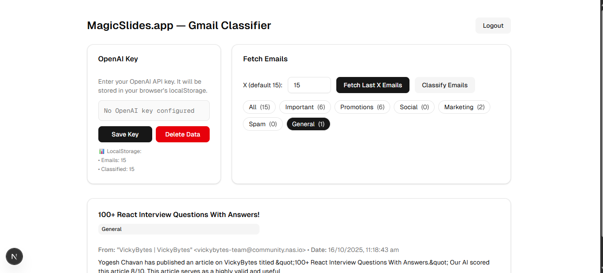

# Gmail Classifier App (MagicSlides.app Intern Assignment)

A full-stack web app that:
- Authenticates users with Google OAuth
- Fetches the last X Gmail emails (default X = 15) without any database
- Asks the user for their OpenAI API key and stores it in localStorage
- Classifies emails using OpenAI (via LangChain.js) into:
  - Important, Promotions, Social, Marketing, Spam, General

This README provides exact instructions to set up, run, test, and submit per the assignment.

---

## Screenshots (placeholders)

- App dashboard (Before login)  
  
- Emails fetched (X = 15 by default)  
  
- Classification results  
  

---

## Tech Stack

- Frontend: Next.js (App Router), Tailwind CSS
- Backend: Next.js API Routes
- Auth: Google OAuth 2.0
- APIs: Gmail API for email fetching, OpenAI via LangChain.js for classification
- Storage: No database; emails and OpenAI key are stored in browser localStorage

---

## Architecture Overview

- Client
  - Login with Google
  - Input OpenAI API key (saved to localStorage)
  - Trigger “Fetch last X emails” (default 15)
  - Trigger “Classify emails”
  - Filter results by category
- Server (API Routes)
  - /api/auth/google/start → begin OAuth
  - /api/auth/google/callback → complete OAuth, set secure HTTP-only cookies
  - /api/auth/session → check auth state
  - /api/auth/logout → sign out
  - /api/gmail/fetch → fetch last X emails using Gmail API and user tokens
  - /api/classify → use OpenAI (LangChain.js) to classify client-provided emails

Security/Data Handling:
- No DB is used (as required).
- Emails and the user’s OpenAI key live in localStorage on the client.
- Google OAuth tokens are stored in server HTTP-only cookies.
- The OpenAI key is sent only for classification requests and never persisted on the server.

---

## Requirements

- Node.js 18+ and npm (or pnpm)
- Google Cloud project with Gmail API enabled
- Google OAuth 2.0 Web Client (Client ID/Secret)
- OpenAI API key (provided by the user in the UI)

---

## Google Cloud Setup (Exact Steps)

1) Create/select a Google Cloud Project.
2) Enable Gmail API:
   - APIs & Services → Library → search “Gmail API” → Enable
3) OAuth consent screen:
   - User Type: External
   - Scopes (add all):
     - https://www.googleapis.com/auth/gmail.readonly
     - openid
     - email
     - profile
   - Test users (add every account that will log in):
     - Your Gmail address
     - theindianappguy@gmail.com (required by the assignment)
   - Save and wait a few minutes for propagation
4) Credentials → Create Credentials → OAuth client ID (Web application)
   - Authorized JavaScript origins:
     - http://localhost:3000
   - Authorized redirect URIs:
     - http://localhost:3000/api/auth/google/callback
   - Copy your Client ID and Client Secret

Important (Submission Requirement): Google verification blocks public access. During testing, only “Test users” can use the app. Make sure to add the evaluator’s email: theindianappguy@gmail.com.

---

## Environment Variables

Create `.env.local` (for local dev) with:

\`\`\`
GOOGLE_CLIENT_ID=YOUR_GOOGLE_CLIENT_ID
GOOGLE_CLIENT_SECRET=YOUR_GOOGLE_CLIENT_SECRET
# Optional if your code expects it:
# GOOGLE_REDIRECT_URI=http://localhost:3000/api/auth/google/callback
\`\`\`

Do NOT put an OpenAI key here. The app asks the user for their OpenAI key at runtime and stores it in localStorage, per the assignment.

---

## Install & Run (Local)

1) Install dependencies:
   - npm install
2) Start dev server:
   - npm run dev
3) Open http://localhost:3000

Usage:
- Click “Login with Google” and choose an account that is on the Test users list.
- Enter your OpenAI API key (sk-...), click “Save Key”.
- Set X (default 15), click “Fetch Last X Emails”.
- Click “Classify Emails” to classify; use category filters to view subsets.

---

## API Reference (Implemented)

- GET /api/auth/google/start  
  Starts Google OAuth with scopes: gmail.readonly, openid, email, profile

- GET /api/auth/google/callback  
  Handles Google callback, exchanges code for tokens, sets HTTP-only cookies

- GET /api/auth/session  
  Returns auth status; useful for gating UI behavior

- POST /api/auth/logout  
  Clears session cookies; 204 on success

- GET /api/gmail/fetch?max=NUMBER  
  Fetch last X emails (default 15, max capped at 50).  
  Response: `{ emails: Array<{ id, from, subject, snippet, bodyText, date }> }`

- POST /api/classify  
  Request body:
  \`\`\`
  {
    "openaiKey": "sk-...",
    "emails": [
      { "id": "...", "from": "...", "subject": "...", "snippet": "...", "bodyText": "..." }
    ]
  }
  \`\`\`
  Response:
  \`\`\`
  {
    "classifications": {
      "<emailId>": "Important" | "Promotions" | "Social" | "Marketing" | "Spam" | "General",
      ...
    }
  }
  \`\`\`

Model: GPT‑4o family via LangChain.js (`@langchain/openai`).

---

## Classification Categories (Required)

- Important: Personal or work-related; requires attention
- Promotions: Sales, discounts, campaigns
- Social: Social networks, friends, family
- Marketing: Marketing, newsletters, notifications
- Spam: Unwanted/unsolicited
- General: If none of the above match

---

## Troubleshooting

- 403 access_denied: “App is being tested; only developer-approved testers”
  - Fix: Add the login email to OAuth consent screen → Test users, including theindianappguy@gmail.com. Ensure you’re using the correct project and OAuth Client.
- “Invalid redirect_uri”:
  - Ensure redirect URI is exactly http://localhost:3000/api/auth/google/callback in both Google Console and the app.
- No refresh_token:
  - First-time consent usually returns refresh_token (using `access_type=offline`, `prompt=consent`). Try again in incognito if needed.
- Still stuck?
  - Try incognito, verify env vars, confirm scopes, confirm you restarted the dev server after changing `.env.local`.

---

## Submission (Exact Instructions)

- Include this README with setup and run instructions
- Ensure code is well‑documented and follows best practices
- Share your GitHub project link with @theindianappguy
- Send an email to: theindianappguy@gmail.com with:
  - GitHub repo link
  - Short overview (stack, routes, how to run)
  - Confirmation that you added the evaluator as a Google OAuth Test user
- Remember: Add the evaluator’s email as a test user (Google verification policy)

---

## Notes on Data & Privacy

- No server database is used
- Emails and OpenAI key are stored in browser localStorage
- OAuth tokens are held in HTTP-only cookies; the OpenAI key is not stored server-side

---